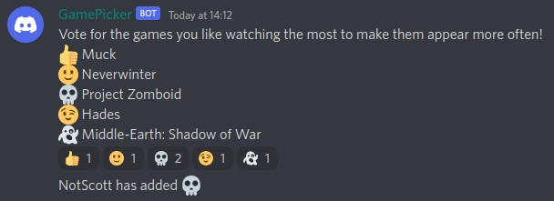

# Game Picker
## About
The title is a bit self explanatory - this bot allows you to pick a name from a list. More specifically, this program uses Discord to allow users to define a list (potentially of games but it could be any list you want) and assign weights to it. A random name from the list will be picked, taking into account the weights - with a greater weight increasing the chances.

## How-To
### Join the server
For this bot to work, you'll need to invite it to your server. I have no idea how to let other people do that, so this part will need to be edited in the future.

### Set up the bot
There is a very easy set-up method involved with this bot. Obviously since you need to pick out from a list, creating a list initially is important. Without the list there's nothing to pick out from!

You can create your list using:
> -addgame [name]

This adds a new member to the list with the default initial starting weight. This initial starting weight can be changed in the code. You can keep adding more games but the max supported games is 8 at a time, you can add more by adding more emojis to the list (better support for this may come in the future). If you want to add games with more than 1 argument/has space in it then you have to have quotations around the name for example -addgame "Project Zomboid". Without the quotations, you'll be adding "Project" and "Zomboid" won't be read.

Note that only users with the "kick members" permission may use this command!

### Use the bot
You can check out your new list using:
> -listgames

Anyone can use this fabulous commands and it has the perks of showing you the weights of every game on the list.

Users can vote for the games they like using:
> -vote

and GamePicker responds as shown below.

We have 5 games on this list and 5 possible emotes. When clicked on the skull reaction, that adds our weight increment to the corresponding game - in this case it's Project Zomboid. You get a handy message showing who voted for what.

The last command we have is pretty important.
> -pick

The pick commands allows the bot to randomly pick a game from the list for you. Not happy with the option it picked? No worries, just keep running the command until you get what you want...